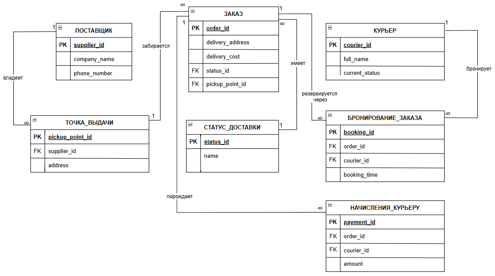

# Data Model

## Описание

Файл содержит описание логической модели данных системы DEL — онлайн-системы управления доставкой заказов от поставщиков до конечных клиентов.

Модель описывает основные сущности предметной области, ключевые данные, CRUD-проверку и связи между сущностями.

Подробное описание предметной области находится в `domain.md`, требования к системе — в `requirements.md`.

## Состав модели

В модели данных рассматриваются сущности, которые нужны для поддержки основных функций системы:

- получение и регистрация заказов;
- ввод заказов оператором;
- передача заказов от поставщиков;
- выбор и бронирование заказа курьером;
- выполнение доставки;
- обновление статусов заказа;
- контроль заказов диспетчером;
- переназначение заказов;
- передача данных в бухгалтерию;
- отображение начисленной оплаты курьеру;
- управление пользователями, ролями и правами доступа.

## Основные сущности

| Сущность | Описание |
|---|---|
| Заказ | Запрос на доставку товара от поставщика к клиенту. |
| Поставщик | Магазин или предприятие питания, передающее заказы в систему DEL. |
| Клиент | Конечный получатель заказа. |
| Курьер | Пользователь системы, выполняющий физическую доставку заказов. |
| Диспетчер | Пользователь системы, управляющий распределением заказов и контролем доставки. |
| Оператор | Пользователь системы, вводящий и корректирующий заказы. |
| Администратор | Пользователь, управляющий доступами и техническим состоянием системы. |
| Бухгалтерия | Внешнее подразделение или система, получающая данные для расчётов. |
| Статус заказа | Текущее состояние заказа в процессе обработки и доставки. |
| Доставка | Факт выполнения заказа курьером от точки получения до клиента. |
| Точка получения | Место, где курьер забирает заказ. |
| Место доставки | Адрес или точка, куда должен быть доставлен заказ. |
| Начисленная оплата | Данные о сумме, рассчитанной для курьера за выполненные доставки. |
| Данные для расчётов | Информация, передаваемая в бухгалтерию для расчёта оплаты и стоимости доставки. |
| Роль | Набор прав доступа пользователя в системе. |
| Пользователь системы | Учётная запись пользователя, работающего с системой. |

## Словарь ключевых данных

| Данные | Назначение |
|---|---|
| Заказ | Основной объект доставки, проходящий путь от поступления до завершения. |
| Поставщик | Источник заказа и участник расчётов за доставку. |
| Клиент / получатель | Конечный получатель заказа. |
| Курьер | Исполнитель доставки. |
| Диспетчер | Пользователь, контролирующий доставку и курьеров. |
| Оператор | Пользователь, вводящий данные заказа. |
| Точка получения заказа | Место, где курьер забирает заказ. |
| Место доставки | Адрес или точка, куда должен быть доставлен заказ. |
| Желаемый срок доставки | Используется для планирования и контроля доставки. |
| Статус заказа | Показывает текущее состояние заказа. |
| Результат доставки | Фиксирует завершение или иной результат доставки. |
| Данные для бухгалтерии | Используются для расчётов с поставщиками и курьерами. |
| Начисленная оплата | Используется для отображения оплаты курьеру. |
| Пользователь, роль и права доступа | Используются для управления доступом в системе. |

## CRUD-проверка сущностей

| Сущность | Create | Read | Update | Delete / Archive |
|---|---|---|---|---|
| Заказ | Создание оператором или поступление от поставщика | Просмотр оператором, курьером и диспетчером | Обновление данных и статусов | Архивация после закрытия |
| Поставщик | Создание записи о поставщике | Просмотр поставщика в заказе | Обновление данных поставщика | Архивация поставщика |
| Клиент | Создание данных получателя в заказе | Просмотр данных доставки | Обновление данных доставки | Архивация вместе с заказом |
| Курьер | Регистрация администратором | Просмотр курьера диспетчером | Обновление профиля и статуса | Архивация при прекращении работы |
| Диспетчер | Создание учётной записи | Просмотр пользователя | Обновление данных и прав | Архивация учётной записи |
| Оператор | Создание учётной записи | Просмотр пользователя | Обновление данных и прав | Архивация учётной записи |
| Администратор | Создание учётной записи | Просмотр пользователя | Обновление данных и прав | Архивация учётной записи |
| Статус заказа | Создание статуса в рамках жизненного цикла заказа | Просмотр статуса участниками процесса | Обновление статуса заказа | Архивация истории статусов |
| Доставка | Создание при принятии заказа курьером | Просмотр доставки курьером и диспетчером | Обновление результата доставки | Архивация после завершения |
| Точка получения | Создание при вводе заказа | Просмотр точки получения | Обновление при корректировке заказа | Архивация вместе с заказом |
| Место доставки | Создание при вводе заказа | Просмотр места доставки | Обновление при корректировке заказа | Архивация вместе с заказом |
| Начисленная оплата | Создание после расчёта | Просмотр курьером | Обновление после пересчёта | Архивация расчётного периода |
| Данные для расчётов | Создание при передаче данных в бухгалтерию | Просмотр бухгалтерией | Обновление при корректировке доставки | Архивация после закрытия периода |
| Роль | Создание роли | Просмотр роли | Обновление прав роли | Архивация роли |
| Пользователь системы | Создание учётной записи | Просмотр пользователя | Обновление профиля и прав | Архивация пользователя |

## Связи между сущностями

| Связь | Описание | Кратность |
|---|---|---|
| Поставщик — Заказ | Поставщик передаёт заказы в систему. | 1:M |
| Заказ — Клиент | Заказ предназначен одному конечному получателю. | M:1 |
| Заказ — Точка получения | Заказ имеет точку получения. | M:1 |
| Заказ — Место доставки | Заказ имеет место доставки. | M:1 |
| Заказ — Статус заказа | Заказ проходит через статусы обработки и доставки. | 1:M |
| Курьер — Заказ | Курьер может выбирать и выполнять заказы. | 1:M |
| Курьер — Доставка | Курьер выполняет доставки. | 1:M |
| Заказ — Доставка | Доставка связана с конкретным заказом. | 1:0..1 |
| Диспетчер — Заказ | Диспетчер контролирует активные заказы и может переназначать их. | 1:M |
| Оператор — Заказ | Оператор создаёт и корректирует заказы. | 1:M |
| Заказ — Данные для расчётов | По заказу формируются данные для расчётов. | 1:1 |
| Доставка — Начисленная оплата | По результату доставки рассчитывается начисленная оплата курьера. | 1:1 |
| Курьер — Начисленная оплата | Курьер видит начисленную оплату в личном кабинете. | 1:M |
| Бухгалтерия — Данные для расчётов | Бухгалтерия получает данные для расчётов. | 1:M |
| Администратор — Пользователь системы | Администратор управляет учётными записями пользователей. | 1:M |
| Роль — Пользователь системы | Одна роль может быть назначена нескольким пользователям. | 1:M |

## ER Diagram

ER Diagram показывает логическую модель данных системы DEL: основные сущности, их атрибуты и связи.

## Вывод

Модель данных DEL строится вокруг заказа и его доставки. Ключевыми сущностями являются заказ, поставщик, клиент, курьер, диспетчер, оператор, статус заказа, доставка и начисленная оплата.

Дополнительные сущности — пользователь, роль, данные для расчётов и бухгалтерия — поддерживают управление доступом, финансовые расчёты и передачу данных во внешние системы.
