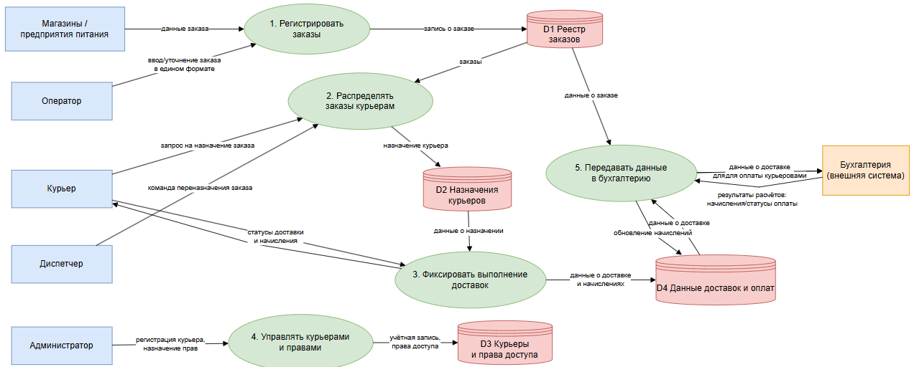
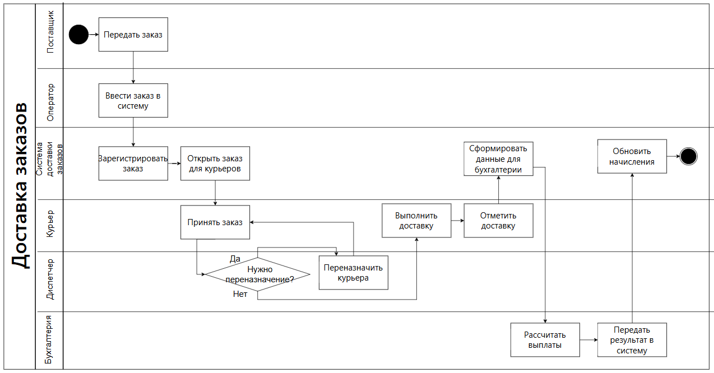
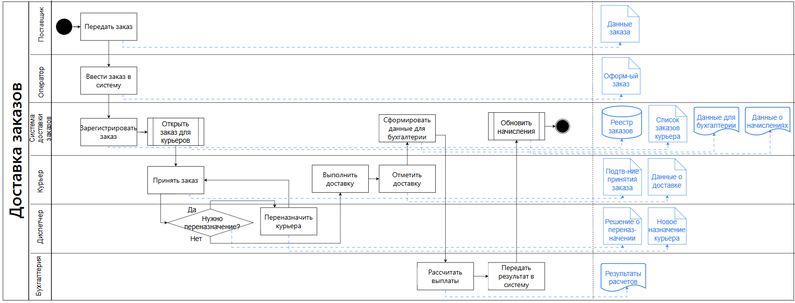
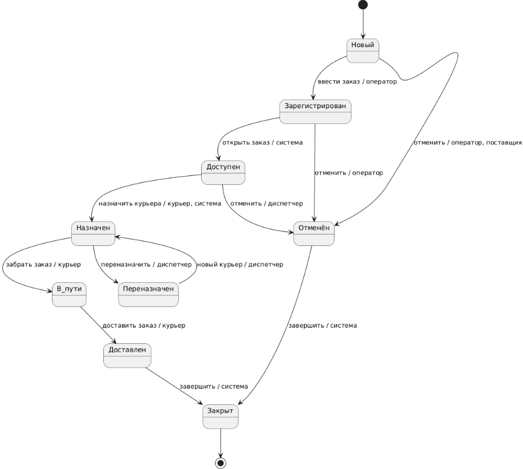

# Process Modeling

## Описание

Файл содержит описание процессных моделей системы DEL — онлайн-системы управления доставкой заказов от поставщиков до конечных клиентов.

В этом разделе собраны диаграммы, которые показывают движение данных, распределение ответственности между ролями, создаваемые артефакты и жизненный цикл заказа на доставку.

Требования к системе описаны в `requirements.md`, модель данных — в `data-model.md`, а переход от текущего состояния к целевому — в `as-is-to-be.md`.

## Область моделирования

Область рассмотрения — целевой процесс работы доставки после внедрения системы DEL.

Модели описывают:

- передачу заказа поставщиком;
- ввод заказа оператором;
- регистрацию заказа системой;
- открытие заказа для курьеров;
- принятие заказа курьером;
- контроль доставки диспетчером;
- переназначение заказа при необходимости;
- выполнение доставки;
- фиксацию результата доставки;
- передачу данных в бухгалтерию;
- расчёт выплат;
- обновление начислений курьеру.

## Используемые диаграммы

| Диаграмма | Назначение | Файл |
|---|---|---|
| Data Flow Diagram | Показывает обмен данными между системой и участниками доставки. | `./diagrams/data-flow-diagram.png` |
| Swimlane Diagram | Показывает процесс доставки с распределением ответственности между ролями. | `./diagrams/swimlane-diagram.png` |
| Additional Swimlane Diagram | Показывает процесс доставки и создаваемые/обновляемые артефакты. | `./diagrams/additional-swimlane-diagram.png` |
| State Diagram | Показывает жизненный цикл заказа на доставку. | `./diagrams/state-diagram.png` |

## Data Flow Diagram

Data Flow Diagram показывает, как система DEL обменивается данными с участниками процесса доставки.

В модели рассматриваются:

- поставщики;
- оператор;
- курьеры;
- диспетчер;
- администратор;
- бухгалтерия;
- система DEL.

Диаграмма отражает передачу заказов от поставщиков, ввод заказов оператором, хранение заказов в системе, работу курьера с заказом, контроль доставки диспетчером, управление доступом и передачу данных во внешнюю бухгалтерию.

## Swimlane Diagram

Swimlane Diagram показывает бизнес-процесс доставки с распределением ответственности между участниками.

В диаграмме используются роли:

- поставщик;
- оператор;
- система;
- курьер;
- диспетчер;
- бухгалтерия.

Диаграмма показывает последовательность действий, точки принятия решений и взаимодействие между ролями в целевом процессе после внедрения системы.

## Additional Swimlane Diagram

Additional Swimlane Diagram показывает процесс доставки с распределением ответственности между ролями и артефакты, которые создаются или обновляются на каждом шаге.

В рамках процесса создаются или обновляются:

- данные заказа;
- оформленный заказ;
- реестр заказов;
- список заказов курьера;
- подтверждение принятия заказа;
- данные о доставке;
- решение о переназначении;
- новое назначение курьера;
- данные для бухгалтерии;
- результаты расчёта;
- данные о начислениях.

## State Diagram

State Diagram показывает жизненный цикл объекта `Заказ на доставку`.

Объект проходит следующие состояния:

| Состояние | Описание |
|---|---|
| Новый | Заказ поступил в процесс обработки. |
| Зарегистрирован | Заказ зарегистрирован в системе. |
| Доступен | Заказ открыт для выбора курьерами. |
| Назначен | Заказ назначен или забронирован курьером. |
| В пути | Курьер получил заказ и выполняет доставку. |
| Доставлен | Заказ доставлен клиенту. |
| Переназначен | Заказ передан другому курьеру. |
| Отменён | Заказ отменён. |
| Закрыт | Заказ завершён и закрыт в системе. |

## Основной целевой процесс доставки

| Шаг | Участник | Действие | Результат |
|---|---|---|---|
| 1 | Поставщик | Передаёт заказ | Данные заказа поступают в процесс. |
| 2 | Оператор | Вводит заказ в систему | Заказ оформлен в едином формате. |
| 3 | Система | Регистрирует заказ | Заказ появляется в реестре. |
| 4 | Система | Открывает заказ для курьеров | Заказ становится доступным. |
| 5 | Курьер | Принимает заказ | Заказ закрепляется за курьером. |
| 6 | Диспетчер | Оценивает необходимость переназначения | При необходимости заказ переназначается. |
| 7 | Курьер | Выполняет доставку | Заказ доставляется клиенту. |
| 8 | Курьер | Отмечает доставку | В системе обновляются данные о доставке. |
| 9 | Система | Формирует данные для бухгалтерии | Данные передаются для расчётов. |
| 10 | Бухгалтерия | Рассчитывает выплаты | Формируются результаты расчёта. |
| 11 | Система | Обновляет начисления | Курьер видит начисленную оплату. |

## Вывод

Процессные модели DEL показывают целевую работу системы после внедрения: от поступления заказа до доставки клиенту, передачи данных в бухгалтерию и обновления начислений курьеру.

Основной процесс строится вокруг заказа, а связанные модели показывают ввод данных, выбор заказа курьером, контроль диспетчером, переназначение, расчёты и изменение состояния заказа.
