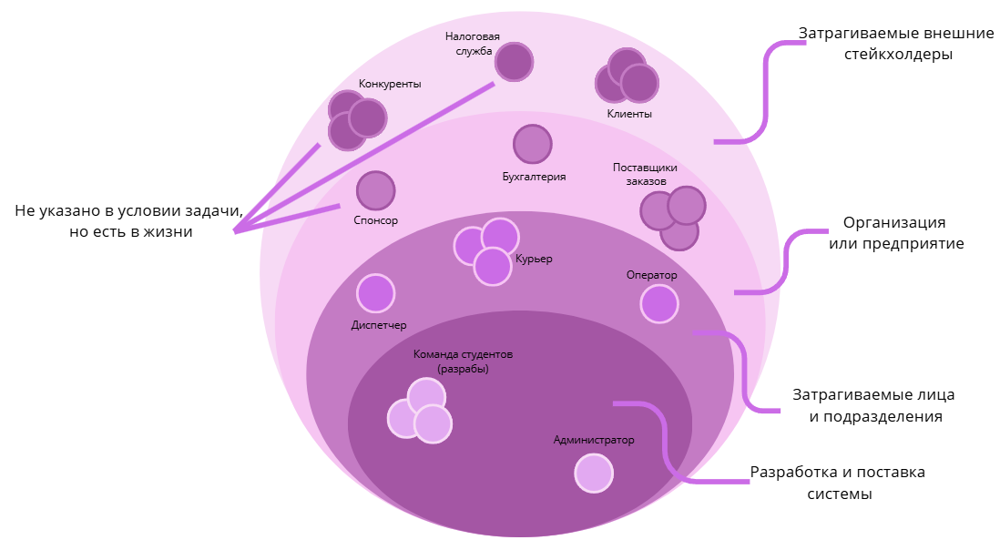

# Stakeholders

## Описание

Файл содержит описание стейкхолдеров системы DEL — онлайн-системы управления доставкой заказов от поставщиков до конечных клиентов.

В этом файле описаны участники, их роли, интересы, потребности и проблемы. Изменение процесса из As-Is в To-Be вынесено в отдельный файл `as-is-to-be.md`.

## Каталог стейкхолдеров

| ID | Стейкхолдер | Тип | Категория | Уровень взаимодействия с системой | Роль в системе / проекте |
|---|---|---|---|---|---|
| ST001 | Команда проекта | Организация / команда проекта | Команда проекта | Создаёт и развивает систему | Разработчики |
| ST002 | Курьер | Физическое лицо | Затронутая сторона | Конечный пользователь | Курьер |
| ST003 | Диспетчер | Физическое лицо | Затронутая сторона | Конечный пользователь | Диспетчер |
| ST004 | Оператор | Физическое лицо | Затронутая сторона | Конечный пользователь | Оператор |
| ST005 | Администратор | Физическое лицо | Поддержка системы | Пользователь административной части | Администратор |
| ST006 | Поставщики заказов | Организация | Внешний участник процесса | Передают данные в систему | Поставщик |
| ST007 | Клиенты / получатели | Физическое лицо | Внешняя затронутая сторона | Получают результат работы системы | Получатель заказа |
| ST008 | Бухгалтерия | Подразделение / внешняя система | Внешняя система / подразделение | Получает данные из системы | Бухгалтерия |
| ST009 | Спонсоры / инвесторы | Организация | Заинтересованная сторона | Не работает в системе постоянно | Инвесторы |
| ST010 | Налоговая служба | Организация | Регулятор | Внешняя контролирующая сторона | Регулятор |
| ST011 | Конкуренты | Организация | Рыночная сторона | Косвенное влияние | Конкуренты |

## Интересы, потребности и проблемы

| ID | Стейкхолдер | Интересы | Потребности | Проблемы |
|---|---|---|---|---|
| ST001 | Команда проекта | Создание работающей системы доставки и развитие проекта | Разрабатывать систему на основе понятных требований и реальных проблем участников | Риск создать ненужный продукт; ручное управление не работает при росте |
| ST002 | Курьер | Получение заказов, понятная стоимость доставки, удобная фиксация результата | Видеть доступные заказы, выбирать заказ, обновлять статус доставки, видеть начисленную оплату | Непрозрачная стоимость заказа; нужно постоянно звонить диспетчеру |
| ST003 | Диспетчер | Контроль курьеров и выполнение доставок | Видеть статусы курьеров и заказов, переназначать проблемные заказы | Нет информации, где находится курьер; сложно переназначить проблемный заказ |
| ST004 | Оператор | Быстрый и корректный ввод заказов | Вводить заказы в едином формате через простой интерфейс с подсказками | Сложная форма ввода; частые опечатки из-за ручного ввода |
| ST005 | Администратор | Управление пользователями и стабильность системы | Регистрировать курьеров, управлять ролями и правами доступа, получать информацию о сбоях | Ручное добавление курьеров занимает много времени; нет уведомлений о сбоях |
| ST006 | Поставщики заказов | Надёжная передача заказов и понимание статуса доставки | Передавать заказы в систему и получать информацию о ходе доставки | Передача заказов ненадёжна; непонятно, забрал ли курьер заказ |
| ST007 | Клиенты / получатели | Своевременное получение заказа и прозрачность доставки | Получать информацию о статусе заказа и времени доставки | Полная неопределённость по времени; невозможно уточнить детали доставки |
| ST008 | Бухгалтерия | Корректные расчёты по доставкам и оплатам | Получать структурированные данные для расчётов и отчётности | Ручной перенос данных ведёт к ошибкам; сверка данных отнимает много времени |
| ST009 | Спонсоры / инвесторы | Оценка прогресса и успешности проекта | Получать прозрачные показатели и KPI проекта | Нет прозрачности в успехе проекта; есть риск потери инвестиций |
| ST010 | Налоговая служба | Корректность выплат и отчётности | Получать корректные данные по расчётам с исполнителями | Риск некорректных выплат курьерам; неправильная классификация самозанятых |
| ST011 | Конкуренты | Сохранение клиентов и курьеров на рынке | Отслеживать появление нового сервиса и реагировать на конкуренцию | Возможен отток клиентов и курьеров к более выгодным предложениям |

## Onion Diagram

Для визуального анализа стейкхолдеров используется Onion Diagram.

Диаграмма показывает окружение системы DEL и распределяет заинтересованные стороны по степени близости к системе.

## Слои Onion Diagram

| Слой | Стейкхолдеры | Описание |
|---|---|---|
| Команда проекта и поддержка | Команда проекта, администратор | Создают, развивают и поддерживают систему |
| Конечные пользователи | Курьер, диспетчер, оператор | Непосредственно работают с системой в операционном процессе доставки |
| Внешние участники процесса | Поставщики заказов, клиенты / получатели, бухгалтерия | Передают данные в систему, получают результат доставки или данные для расчётов |
| Внешние заинтересованные стороны | Спонсоры / инвесторы, налоговая служба | Влияют на требования к прозрачности, отчётности и контролю |
| Рыночная среда | Конкуренты | Косвенно влияет на требования к качеству и конкурентоспособности сервиса |

## Влияние стейкхолдеров на требования

| Стейкхолдер | Влияние на требования |
|---|---|
| Команда проекта | Формирует требования к разработке, развитию и управляемости системы |
| Курьер | Формирует требования к мобильному приложению, просмотру заказов, бронированию, статусам и начисленной оплате |
| Диспетчер | Формирует требования к контролю курьеров, просмотру статусов и переназначению заказов |
| Оператор | Формирует требования к вводу заказов, подсказкам, автозаполнению и снижению ошибок |
| Администратор | Формирует требования к управлению пользователями, ролями и правами доступа |
| Поставщики заказов | Формируют требования к передаче заказов через личный кабинет или API |
| Клиенты / получатели | Формируют требования к уведомлениям, отслеживанию и прозрачности доставки |
| Бухгалтерия | Формирует требования к отчётам, передаче данных и интеграции с внешней бухгалтерской системой |
| Спонсоры / инвесторы | Формируют требования к KPI и дашбордам для оценки прогресса проекта |
| Налоговая служба | Влияет на требования к отчётности по расчётам с курьерами |
| Конкуренты | Косвенно влияют на требования к качеству сервиса и удержанию участников |

## Вывод

Ключевыми стейкхолдерами системы DEL являются курьер, диспетчер, оператор, поставщики заказов, клиенты, бухгалтерия и администратор.

Курьеру важно получать полную информацию о заказе и фиксировать результат доставки через приложение. Диспетчеру важно видеть статусы и быстро переназначать проблемные заказы. Оператору нужен удобный ввод заказов. Поставщикам и клиентам нужна прозрачность доставки. Бухгалтерии нужны структурированные данные для расчётов.

Внешние стейкхолдеры влияют на требования к прозрачности, отчётности, контролю и конкурентоспособности сервиса.
