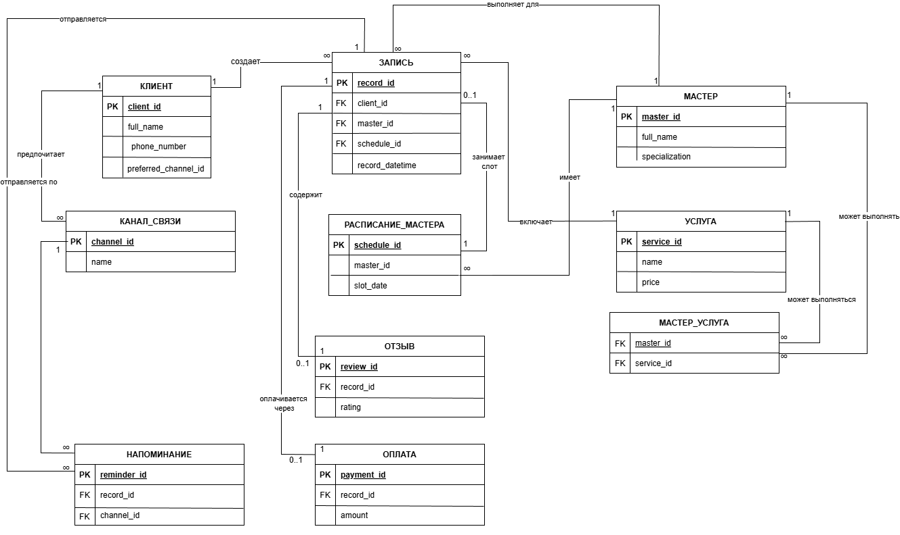

# Data Model

## Описание

Файл содержит описание логической модели данных системы BARB — онлайн-системы записи клиентов на услуги сети барбершопов.

Модель данных построена на основе:

- списка сущностей;
- CRUD-матрицы;
- словаря данных;
- ER-диаграммы.

В этом файле описаны только сущности и данные, которые представлены в модели данных. Процессы, требования и стейкхолдеры описаны в отдельных файлах.

## Состав модели

В модели данных BARB представлены следующие сущности:

- Клиент;
- Канал связи;
- Запись;
- Расписание мастера;
- Мастер;
- Услуга;
- Мастер_услуга;
- Напоминание;
- Отзыв;
- Оплата.

`Мастер_услуга` присутствует на ER-диаграмме как связующая сущность между мастером и услугой. В таблицах `entity`, `crud` и `dict` она отдельно не детализирована.

## Основные сущности

| Сущность | Назначение | Ключевые атрибуты |
|---|---|---|
| Услуга | Описывает вид работы, который может быть оказан клиенту, и его базовые параметры. | ID услуги, наименование, цена, продолжительность |
| Расписание мастера | Определяет рабочие часы и формирует доступные временные слоты для конкретного мастера на определённую дату. | ID расписания, ID мастера, дата, время начала слота, время конца слота |
| Запись | Фиксирует факт бронирования клиентом конкретной услуги у конкретного мастера на определённое время. Является центральной сущностью. | ID записи, ID клиента, ID мастера, ID услуги, дата и время записи, статус |
| Напоминание | Содержит информацию об автоматическом уведомлении, которое система отправляет клиенту о предстоящей записи. | ID напоминания, ID записи, текст сообщения, дата и время отправки, статус отправки |
| Канал связи | Справочник возможных способов связи с клиентом для отправки уведомлений и напоминаний. | ID канала, наименование |
| Отзыв | Содержит обратную связь, оставленную клиентом после получения услуги. | ID отзыва, ID записи, оценка, текст отзыва, дата создания |
| Оплата | Фиксирует финансовую транзакцию по оплате выполненной услуги. | ID оплаты, ID записи, сумма, способ оплаты, дата и время оплаты, статус |
| Мастер | Сотрудник, который непосредственно оказывает услуги клиентам. | ID мастера, ФИО, специализация, рейтинг |
| Клиент | Зарегистрированный или незарегистрированный пользователь, который записывается на услугу. | ID клиента, ФИО, контактный телефон, предпочитаемый канал связи |

## Словарь данных

| Сущность | Атрибут | Описание | Тип данных | Обязательность |
|---|---|---|---|---|
| Мастер | master_id | Уникальный идентификатор мастера | Integer | Да |
| Мастер | full_name | ФИО мастера | String | Да |
| Мастер | specialization | Специализация мастера | String | Нет |
| Мастер | rating | Рейтинг мастера по отзывам, вычисляемый | Decimal | Нет |
| Клиент | client_id | Уникальный идентификатор клиента | Integer | Да |
| Клиент | full_name | ФИО клиента | String | Да |
| Клиент | phone_number | Контактный телефон клиента | String | Да |
| Клиент | preferred_channel_id | Предпочитаемый канал связи клиента | Integer | Нет |
| Услуга | service_id | Уникальный идентификатор услуги | Integer | Да |
| Услуга | name | Наименование услуги | String | Да |
| Услуга | price | Цена услуги | Decimal | Да |
| Услуга | duration_minutes | Продолжительность услуги в минутах | Integer | Да |
| Расписание мастера | schedule_id | Уникальный идентификатор записи расписания | Integer | Да |
| Расписание мастера | master_id | Мастер, к которому относится расписание | Integer | Да |
| Расписание мастера | slot_date | Дата рабочего слота | Date | Да |
| Расписание мастера | start_time | Время начала слота | Time | Да |
| Расписание мастера | end_time | Время окончания слота | Time | Да |
| Запись | record_id | Уникальный идентификатор записи | Integer | Да |
| Запись | client_id | Клиент, если зарегистрирован | Integer | Нет |
| Запись | client_contact | Контакт для незарегистрированного посетителя | String | Да |
| Запись | master_id | Мастер, к которому записались | Integer | Да |
| Запись | service_id | Выбранная услуга | Integer | Да |
| Запись | record_datetime | Дата и время записи | DateTime | Да |
| Запись | status | Статус записи | Enum | Да |
| Напоминание | reminder_id | Уникальный идентификатор напоминания | Integer | Да |
| Напоминание | record_id | Запись, о которой система напоминает | Integer | Да |
| Напоминание | channel_id | Канал, по которому отправляется напоминание | Integer | Да |
| Напоминание | message_text | Текст сообщения | String | Да |
| Напоминание | planned_send_datetime | Плановая дата и время отправки | DateTime | Да |
| Напоминание | sent_datetime | Фактическая дата и время отправки | DateTime | Нет |
| Напоминание | sending_status | Статус отправки | Enum | Да |
| Канал связи | channel_id | Уникальный идентификатор канала | Integer | Да |
| Канал связи | name | Наименование канала | String | Да |
| Отзыв | review_id | Уникальный идентификатор отзыва | Integer | Да |
| Отзыв | record_id | Запись, по которой оставлен отзыв | Integer | Да |
| Отзыв | rating | Оценка от 1 до 5 | Integer | Да |
| Отзыв | review_text | Текст отзыва | String | Нет |
| Отзыв | created_at | Дата и время создания | DateTime | Да |
| Оплата | payment_id | Уникальный идентификатор оплаты | Integer | Да |
| Оплата | record_id | Запись, которая оплачивается | Integer | Да |
| Оплата | amount | Сумма оплаты | Decimal | Да |
| Оплата | payment_method | Способ оплаты | Enum | Да |
| Оплата | payment_datetime | Дата и время оплаты | DateTime | Нет |
| Оплата | status | Статус оплаты | Enum | Да |

## CRUD-матрица

| Сущность | Create | Read | Update | Delete / Archive |
|---|---|---|---|---|
| Услуга | Менеджер создаёт услугу. | Клиент, посетитель, мастер и менеджер просматривают услуги. | Менеджер изменяет параметры услуги. | Менеджер переводит услугу в архив. |
| Расписание мастера | Менеджер создаёт расписание мастера. | Мастер, клиент, посетитель и менеджер просматривают расписание. | Менеджер корректирует расписание. | Гипотеза: менеджер или система переводит расписание в архив по истечении срока. |
| Запись | Клиент, посетитель или менеджер создаёт запись на услугу. | Клиент, мастер и менеджер просматривают запись. | Клиент или менеджер изменяет или отменяет запись. | Менеджер отменяет запись без физического удаления. |
| Напоминание | Система создаёт напоминание. | Менеджер просматривает статус отправки. | Система обновляет статус отправки. | Система отменяет напоминание при отмене записи. |
| Канал связи | Менеджер настраивает канал связи. | Клиент и менеджер просматривают доступные каналы. | Менеджер изменяет настройки канала. | Гипотеза: администратор деактивирует канал без физического удаления. |
| Отзыв | Клиент оставляет отзыв. | Мастер и менеджер просматривают отзывы. | Гипотеза: клиент редактирует отзыв в течение 24 часов. | Менеджер удаляет или скрывает отзыв. |
| Оплата | Менеджер фиксирует оплату услуги. | Менеджер и бухгалтерия просматривают оплату. | Менеджер корректирует оплату. | Гипотеза: бухгалтерия оформляет возврат без удаления записи. |
| Клиент | Клиент, посетитель или менеджер создаёт профиль клиента или вводит контактные данные при записи. | Клиент и менеджер просматривают профиль клиента. | Клиент или менеджер обновляет контактные данные и предпочтения. | Гипотеза: менеджер или система деактивирует профиль без физического удаления. |
| Мастер | Менеджер создаёт карточку мастера. | Мастер и менеджер просматривают профиль мастера и расписание. | Менеджер или мастер обновляет данные мастера и специализацию. | Гипотеза: менеджер деактивирует мастера без физического удаления. |

## Связи между сущностями

| Связь | Описание |
|---|---|
| Клиент — Запись | Клиент создаёт запись на услугу. |
| Клиент — Канал связи | Клиент предпочитает канал связи. |
| Напоминание — Клиент | Напоминание отправляется клиенту. |
| Напоминание — Канал связи | Напоминание отправляется по выбранному каналу связи. |
| Запись — Расписание мастера | Запись занимает слот в расписании мастера. |
| Расписание мастера — Мастер | Расписание относится к конкретному мастеру. |
| Запись — Услуга | Запись выполняется для выбранной услуги. |
| Мастер — Мастер_услуга | Мастер может выполнять услуги через связующую сущность. |
| Услуга — Мастер_услуга | Услуга может выполняться мастерами через связующую сущность. |
| Запись — Отзыв | По записи может быть оставлен отзыв. |
| Запись — Оплата | Запись оплачивается через оплату. |

## ER Diagram

ER Diagram показывает логическую модель данных системы BARB и связи между сущностями.

## Вывод

Модель данных BARB строится вокруг сущности `Запись`. Она связывает клиента, мастера, услугу, расписание, оплату, отзыв и напоминание.

Ключевые справочные и вспомогательные сущности модели — `Канал связи`, `Расписание мастера`, `Мастер`, `Услуга` и связующая сущность `Мастер_услуга`.
