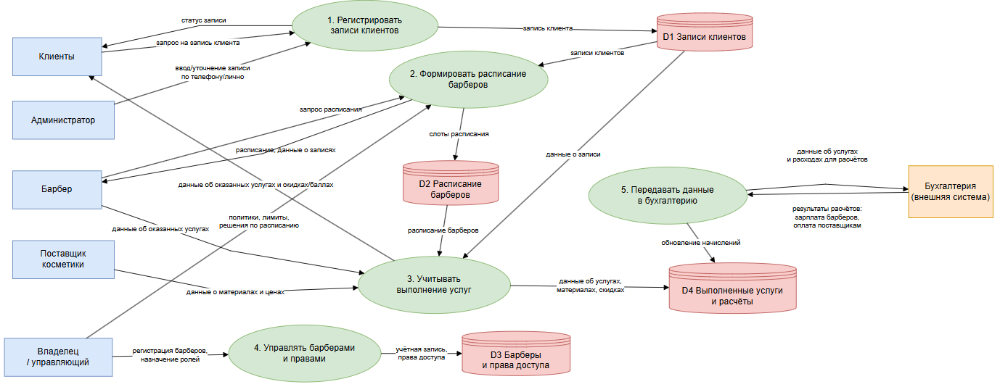
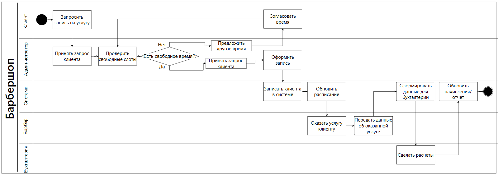
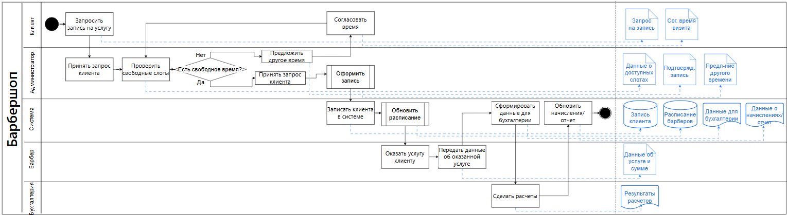
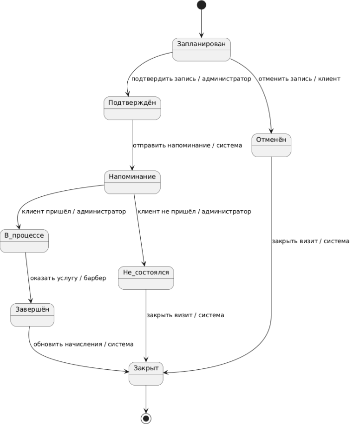
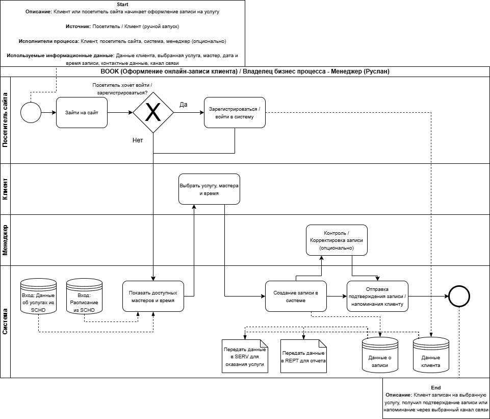

# Process Modeling

## Описание

Файл содержит описание процессных моделей системы BARB — онлайн-системы записи клиентов на услуги сети барбершопов.

В этом разделе собраны диаграммы, которые показывают движение данных, распределение ответственности между ролями, жизненный цикл визита клиента и ключевой бизнес-процесс онлайн-записи.

Требования к системе описаны в `requirements.md`, модель данных — в `data-model.md`, а переход от текущего состояния к целевому — в `as-is-to-be.md`.

## Область моделирования

Область рассмотрения — целевой процесс работы барбершопа после внедрения системы BARB.

Модели описывают:

- запись клиента на услугу;
- выбор услуги, мастера и свободного времени;
- управление расписанием мастеров;
- оказание услуги;
- фиксацию результата услуги;
- обработку оплаты;
- передачу данных в бухгалтерию;
- работу с отзывами;
- формирование отчётов;
- просмотр расписания и записей мастером.

## Используемые диаграммы

| Диаграмма | Назначение | Файл |
|---|---|---|
| Data Flow Diagram | Показывает потоки данных между системой и внешними участниками. | `./diagrams/data-flow-diagram.png` |
| Swimlane Diagram | Показывает процесс работы барбершопа с распределением ответственности между ролями. | `./diagrams/swimlane-diagram.png` |
| Additional Swimlane Diagram | Показывает процесс записи и оказания услуги с создаваемыми и обновляемыми артефактами. | `./diagrams/additional-swimlane-diagram.png` |
| State Diagram | Показывает жизненный цикл визита клиента. | `./diagrams/state-diagram.png` |
| BPMN Diagram | Показывает ключевой бизнес-процесс оформления онлайн-записи клиента. | `./diagrams/bpmn-booking-process.png` |

## Data Flow Diagram

Data Flow Diagram показывает потоки данных между системой BARB и участниками процесса.

В модели рассматриваются:

- клиенты;
- администратор;
- барберы;
- поставщик косметики;
- владелец;
- бухгалтерия;
- система BARB.

Диаграмма отражает основные потоки данных, связанные с записью клиентов, управлением расписанием, оказанием услуг, расчётами и передачей агрегированных данных во внешнюю бухгалтерию.

## Swimlane Diagram

Swimlane Diagram показывает бизнес-процесс работы барбершопа с распределением ответственности между участниками.

В диаграмме используются роли:

- клиент;
- администратор;
- система;
- барбер;
- владелец / управляющий;
- бухгалтерия.

Диаграмма показывает последовательность действий, точки принятия решений и взаимодействие между ролями в целевом процессе после внедрения системы.

## Additional Swimlane Diagram

Additional Swimlane Diagram показывает процесс записи и оказания услуги с распределением ответственности между ролями.

Особенность диаграммы — отображение артефактов, которые создаются или обновляются в процессе.

В рамках процесса создаются или обновляются:

- запрос на запись;
- данные о доступных слотах;
- подтверждение записи;
- правила доступного времени;
- запись клиента;
- расписание барберов;
- данные об оказанной услуге;
- данные о начислении;
- результаты расчёта.

## State Diagram

State Diagram показывает жизненный цикл объекта `Визит клиента`.

Объект проходит следующие состояния:

| Состояние | Описание |
|---|---|
| Запланирован | Визит создан в системе после выбора услуги, мастера и времени. |
| Подтверждён | Запись подтверждена системой или участником процесса. |
| В процессе | Клиент пришёл на услугу, услуга выполняется мастером. |
| Завершён | Услуга оказана. |
| Отменён | Визит отменён клиентом или менеджером. |
| Не состоялся | Клиент не пришёл или услуга не была оказана. |
| Закрыт | Визит завершён с фиксацией результата, оплаты или итогового статуса. |

## BPMN Diagram

BPMN-диаграмма используется для детального описания ключевого бизнес-процесса системы BARB — оформления онлайн-записи клиента на услугу.

В качестве основной BPMN-модели выбран процесс `Оформление онлайн-записи клиента`, так как он отражает центральную пользовательскую ценность системы: клиент или посетитель может самостоятельно записаться на услугу без звонка менеджеру.

## BPMN: оформление онлайн-записи клиента

Процесс начинается, когда зарегистрированный клиент или незарегистрированный посетитель открывает форму онлайн-записи и выбирает параметры будущего визита.

В процессе используются следующие данные:

- тип услуги;
- конкретная услуга;
- мастер;
- свободное время;
- имя клиента или посетителя;
- контактные данные;
- канал связи.

Основной результат процесса — созданная запись клиента на выбранную услугу, к выбранному мастеру и на свободный временной интервал.

После создания записи система фиксирует данные записи и отправляет клиенту подтверждение или напоминание через выбранный канал связи.

## Роль BPMN-диаграммы в проекте

| Модель | Что показывает |
|---|---|
| DFD | Какие данные передаются между системой и участниками. |
| Swimlane Diagram | Кто выполняет действия в процессе. |
| State Diagram | Как меняется состояние визита клиента. |
| BPMN Diagram | Как выполняется ключевой бизнес-процесс онлайн-записи. |

## Вывод

Процессные модели BARB показывают целевую работу системы после внедрения: от записи клиента и управления расписанием до оказания услуги, оплаты, отзывов и отчётности.

Основной процесс строится вокруг записи клиента на услугу. Для публичного портфолио оставлена одна BPMN-диаграмма — оформление онлайн-записи клиента.
